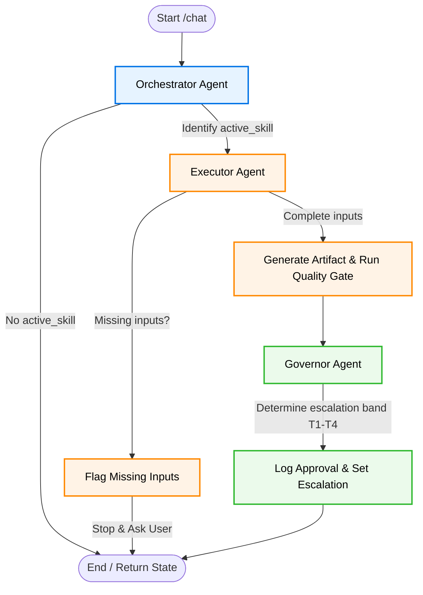

# AgenticPMO

<p align="center">
  <a href="https://doi.org/10.5281/zenodo.20533682"></a>
  
  
  
  
</p>

---

## 🎯 Executive Overview

**AgenticPMO** is the orchestration and intelligence layer designed to programmatically execute **PMI PMBOK® 8th Edition** project management workflows. 

It is built as an autonomous multi-agent state machine on top of the **[PMOSkills SDK](https://github.com/fakhruldeen/PMOSkills)**, which provides 48 executable skills, 41 process records, and 92 templates. AgenticPMO translates natural language project instructions into structured, verified project management artifacts (such as Context Registers, charters, risk registers) and routes approvals through a quantitative escalation matrix.

---

## 🗺️ System Architecture

AgenticPMO runs a cyclic state machine powered by **LangGraph**. The workflow dynamically loops to collect missing project inputs before executing the requested PMBOK skill:



### Agent Nodes

1. **Orchestrator Agent (`agents/orchestrator.py`)**:
   - Parses the user's natural language input.
   - Extracts project identifiers, budgets, contingency spends, variances, and sponsor details.
   - Maps requests to appropriate skill codes from the PMOSkills registry (e.g. `SKL-01-01` to establish project governance).
2. **Executor Agent (`agents/executor.py`)**:
   - References the `pmoskills` SDK database.
   - Audits the current context for mandatory variables required by the skill.
   - Pauses execution and requests missing variables from the user if any are absent.
   - Generates compliant, markdown-formatted artifacts and writes them to the `artifacts/` folder.
3. **Governor Agent (`agents/governor.py`)**:
   - Evaluates project parameters against a quantitative decision matrix.
   - Assigns a governance band (`T1` to `T4`) based on budget, cost variance, or strategic impact.
   - Demands Human-In-The-Loop (HITL) sponsor authorization for high-risk decisions (`T3` & `T4`).

---

## ⚖️ Governance & Escalation Band Matrix

| Band | Characteristics | Default Authority | Action Pathway |
|---|---|---|---|
| **T1 Operational** | Within baseline tolerances, budget <= $100K | Project Manager (PM) | Execute & log internally |
| **T2 Controlled** | Cost variance between 5% and 10% | Change Control Board (CCB) | Route via change control workflows |
| **T3 Governance** | Budget > $100K or cost variance > 10% | Project Sponsor | **Requires formal Sponsor authorization** |
| **T4 Enterprise** | Strategic impact, cross-project portfolio alignment | Portfolio Board / Executive | **Executive portfolio board intervention** |

---

## ⚙️ Installation & Setup

### Prerequisites
- Python 3.10+
- Virtual environment tool

### Installation Steps

1. **Clone the Repository & Navigate to Workspace:**
   ```bash
   git clone <repository_url>
   cd AgenticPMO
   ```

2. **Create and Activate Virtual Environment:**
   ```bash
   python3 -m venv venv
   source venv/bin/activate
   ```

3. **Install Dependencies:**
   ```bash
   pip install -r requirements.txt
   ```

4. **Install PMOSkills SDK:**
   The orchestration layer leverages the `pmoskills` core module. Install it via PyPI:
   ```bash
   pip install pmoskills
   ```

---

## 🚀 Running the API Server

Start the FastAPI application using `uvicorn`:

```bash
PYTHONPATH=. uvicorn api.main:app --reload --host 127.0.0.1 --port 8000
```

### Health Check Endpoint
```bash
curl -s http://127.0.0.1:8000/
```
Response:
```json
{
  "status": "healthy",
  "service": "AgenticPMO Orchestrator",
  "framework": "PMBOK 8th Edition",
  "llm_configured": false
}
```

### Executing a Chat Workflow
Post a request to start a PMBOK 8 process:

```bash
curl -s -X POST -H "Content-Type: application/json" \
  -d '{"message": "Establish governance for Aero Project with budget $120000"}' \
  http://127.0.0.1:8000/chat
```

Because the sponsor was not specified, the state machine will automatically halt and request the missing input:
```json
{
  "messages": [
    {"role":"human","content":"Establish governance for Aero Project with budget $120000"},
    {"role":"ai","content":"[Orchestrator Mock] Request matches skill SKL-01-01..."},
    {"role":"ai","content":"[Executor Mock] Missing inputs for SKL-01-01: ['Sponsor']. Please provide: Sponsor."}
  ],
  "current_project_context": {
    "project_name": "Aero Project",
    "project_budget": 120000.0
  },
  "active_skill": "SKL-01-01",
  "missing_inputs": ["Sponsor"],
  "generated_artifact": null,
  "escalation_level": null
}
```

Resume the workflow by passing back the serialized state with the missing field answered:
```bash
curl -s -X POST -H "Content-Type: application/json" \
  -d '{"message": "The project sponsor is Alice Smith", "state": {"messages": [...], "current_project_context": {...}, "active_skill": "SKL-01-01", "missing_inputs": ["Sponsor"]}}' \
  http://127.0.0.1:8000/chat
```

---

## 🧪 Running Tests

Verify the orchestrator state machine, executor templates, and governor thresholds using `pytest`:

```bash
PYTHONPATH=. pytest tests/test_graph.py -v
```

---

## 📖 Citation & References

To cite **AgenticPMO** in your academic work:

```bibtex
@software{agenticpmo2026,
  author       = {Fakhruldeen, Mohamed (Fouad)},
  title        = {{fakhruldeen/AgenticPMO: Release v0.1.1}},
  month        = jun,
  year         = 2026,
  publisher    = {Zenodo},
  version      = {v0.1.1},
  doi          = {10.5281/zenodo.20533683},
  url          = {https://doi.org/10.5281/zenodo.20533683}
}
```

> Mohamed (Fouad) Fakhruldeen. (2026). fakhruldeen/AgenticPMO: Release v0.1.1 (v0.1.1). Zenodo. https://doi.org/10.5281/zenodo.20533683

This project utilizes the **PMOSkills** repository schema and database as its underlying core:

```bibtex
@misc{pmoskills2026,
  author       = {Fakhruldeen, Mohamed Fouad},
  title        = {{PMOSkills: An Executable Skill System \& PMO Reference Architecture built on PMI PMBOK® 8th Edition}},
  month        = jun,
  year         = 2026,
  publisher    = {Zenodo},
  version      = {v0.5},
  doi          = {10.5281/zenodo.20510540},
  url          = {https://doi.org/10.5281/zenodo.20510540}
}
```

*PMBOK and PMI are registered marks of the Project Management Institute, Inc.*

---

> [!NOTE]
> **Independent Academic Project:** This repository contains summaries, templates, and compliance test suites compiled from public project management frameworks. PMBOK and PMI are registered trademarks of the Project Management Institute, Inc. This project is independently developed and is not affiliated with or endorsed by PMI.

---

*Authority: PMBOK 8 Primary · PMI Companion References Secondary · Organization-Defined Tertiary*  
*Project: PMI PMBOK 8 Knowledge Base Repository Space*  
*Maintainer:* **Mohamed Fouad Fakhruldeen *[GitHub](https://github.com/fakhruldeen), [LinkedIn](https://www.linkedin.com/in/fakhruldeen), [Website](https://fakhruldeen.me)***

