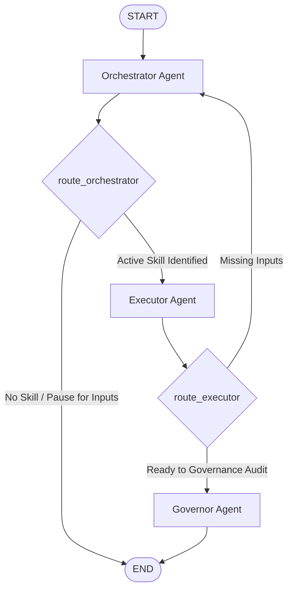

# System Architecture

**AgenticPMO** is designed as a cyclic state machine powered by **LangGraph**. It coordinates specialized, cooperative agents to automate PMBOK® 8th Edition workflows while preventing execution loops and maintaining state consistency across stateless HTTP requests.

---

## 🗺️ State Machine Execution Loop

The orchestration layer executes a conditional state loop. If a project management skill requires inputs that are not present in the current project context, the graph pauses, prompts the client with instructions, and resumes once those details are supplied.



---

## 🗂️ Graph State Schema (`PMOState`)

The state of the orchestration workflow is defined as a `TypedDict` in [graph/state.py](file:///home/mohamed/Desktop/Work/AgenticPMO/AgenticPMO/graph/state.py). This state acts as the shared context for all agent nodes in the network:

```python
from typing import TypedDict, List, Dict, Optional, Any, Annotated
from langchain_core.messages import BaseMessage
from langgraph.graph.message import add_messages

class PMOState(TypedDict):
    messages: Annotated[List[BaseMessage], add_messages]
    """List of chat messages representing the ongoing conversation."""
    
    current_project_context: Dict[str, Any]
    """Extracted metadata and key-value pairs of project variables (e.g. name, budget)."""
    
    active_skill: Optional[str]
    """The identifier of the PMBOK 8 skill currently running (e.g., SKL-01-01)."""
    
    missing_inputs: List[str]
    """List of mandatory variables required for the active skill that are not yet provided."""
    
    generated_artifact: Optional[str]
    """The markdown content of the generated project management template/artifact."""
    
    escalation_level: Optional[str]
    """Governance tier classification (T1, T2, T3, T4) based on budget and variance audits."""
```

---

## 🔀 Conditional Routing Functions

The flow transitions between node executions are governed by two deterministic routing functions defined in [graph/workflow.py](file:///home/mohamed/Desktop/Work/AgenticPMO/AgenticPMO/graph/workflow.py):

### 1. `route_orchestrator`
Determines if the flow should proceed to the Executor or terminate:
- **Loop Prevention**: If the latest message in the state is an AI message asking for missing inputs, routing returns `END`. This prevents the graph from looping indefinitely in background threads.
- **Skill Execution**: If an `active_skill` is set (either detected in the current turn or carried over from a resumed state), routing returns `"executor"`.
- **Default**: Otherwise, routing terminates at `END`.

### 2. `route_executor`
Routes from the Executor based on context completeness:
- **Input collection**: If `missing_inputs` are present, the workflow loops back to `"orchestrator"` so that the orchestrator can report the missing fields to the user.
- **Auditing**: If all mandatory inputs are satisfied, the workflow proceeds to the `"governor"` node for variance check.

---

## 💾 State Serialization & Resumption

Because the web layer (FastAPI) is stateless, multi-turn interactions (such as pausing to ask for the project sponsor and resuming with the sponsor's name) rely on client-driven state serialization.

1. **State Paused**: The graph execution finishes with `missing_inputs` (e.g., `["Sponsor"]`) and the `active_skill` (e.g., `SKL-01-01`).
2. **Serialization**: The FastAPI `/chat` endpoint serializes this internal graph state into a JSON object and returns it to the client.
3. **Resumption**: The client sends a subsequent request containing the new message ("The sponsor is Alice Smith") along with the serialised `state` object.
4. **Reconstruction**: The FastAPI endpoint reconstructs the LangGraph state using the client's provided payload before invoking the state machine, allowing execution to seamlessly continue from where it paused.
